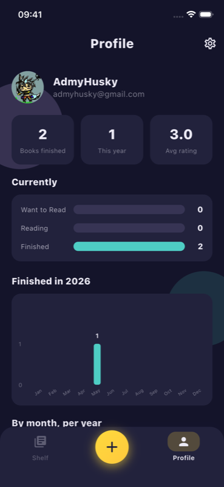

# 📚 My Shelf

A personal digital bookshelf for **Net ([admyhusky](https://github.com/NetKanet))**.
Sign in with Google, keep one shelf of books filtered by status, scan an ISBN to add a
book, and track status / dates / rating / review per book. Finished books surface live on
a public profile site — covers, titles, authors, finish dates and ratings, **never the
private review**.

> Built with [Spec Kit](https://github.com/github/spec-kit). See
> [`specs/001-mvp-foundation/`](specs/001-mvp-foundation/) for the spec, plan, and tasks,
> and [`.specify/memory/constitution.md`](.specify/memory/constitution.md) for the project
> principles.

## Screenshots

| Shelf | Profile |
|:-----:|:-------:|
|  |  |

## Features

- **Google sign-in** → Supabase Auth, with an auth-guarded router.
- **One combined shelf** grouped by finish year, with a funnel filter
  (All / Want to Read / Reading / Finished).
- **Add by ISBN scan** — cache-first: checks the local catalog, then Google Books, then a
  full-page manual entry fallback.
- **Book detail** — set status, start/finish dates, half-star rating, and a private
  review; set a cover by pasting an image link or uploading a photo.
- **Profile dashboard** — headline counts, a status breakdown, a monthly bar chart, a
  per-year multi-line chart, and your Google avatar. Light & full dark mode.
- **Public web profile** — `admyhusky.dev` reads finished books live from a read-only
  Supabase view; the review column is never exposed.

## Tech stack

| Layer | Choice |
|-------|--------|
| Mobile app | Flutter + Riverpod + GoRouter |
| Backend | Supabase — Postgres, Auth, Row-Level Security, Storage |
| ISBN lookup | Google Books API (no key, cache-first) |
| Scanner | `mobile_scanner` |
| Charts | `fl_chart` |

Cover images are stored as a URL whenever possible; uploaded covers go to a public
Storage bucket (5 MB / image-only) and only the resulting URL is persisted. Everything
stays inside each service's free tier.

## Project structure

```
app/                       Flutter mobile app
  lib/
    core/                  config, theme, router, shared widgets, providers
    features/              auth · shelf · scan · book_detail · profile · home
    models/                Book, UserBook
    services/              SupabaseService, GoogleBooksService
  test/                    unit + flow tests
specs/001-mvp-foundation/  Spec Kit spec, plan, data-model, contracts, tasks
docs/                      PRD, UI mockup, session notes
.specify/                  constitution + Spec Kit config
```

## Getting started

```bash
cd app
flutter pub get
```

Create `app/lib/core/config/supabase_config.dart` (gitignored — never committed) from the
example, then fill in your own values:

```bash
cp app/lib/core/config/supabase_config.example.dart \
   app/lib/core/config/supabase_config.dart
# set: Supabase URL, publishable key, Google server client id
```

Run on a simulator/device:

```bash
flutter run
```

## Data model & privacy

- `books` — shared catalog (public read).
- `user_books` — the owner's shelf (RLS: owner full access; **no anon read**).
- `app_config` — single row pointing at the profile owner's `user_id`.
- `public_finished_shelf` — read-only view exposing only finished books of the owner and
  only safe columns (cover, title, author, year, finish date, rating). The public website
  reads **this view only** with the publishable key; `review` is never selectable.

## Quality gates

```bash
flutter analyze   # 0 issues
flutter test      # all tests pass
```

## Status

Mobile app (US1–US4) and v2 UI polish complete; public-web integration wired against the
live view. Remaining: deploy the public site and validate the quickstart scenarios. See
[`docs/prd.md`](docs/prd.md) → "Implementation status".

## License

[MIT](LICENSE) © 2026 Kanet Kampiranon ([admyhusky](https://github.com/NetKanet))
